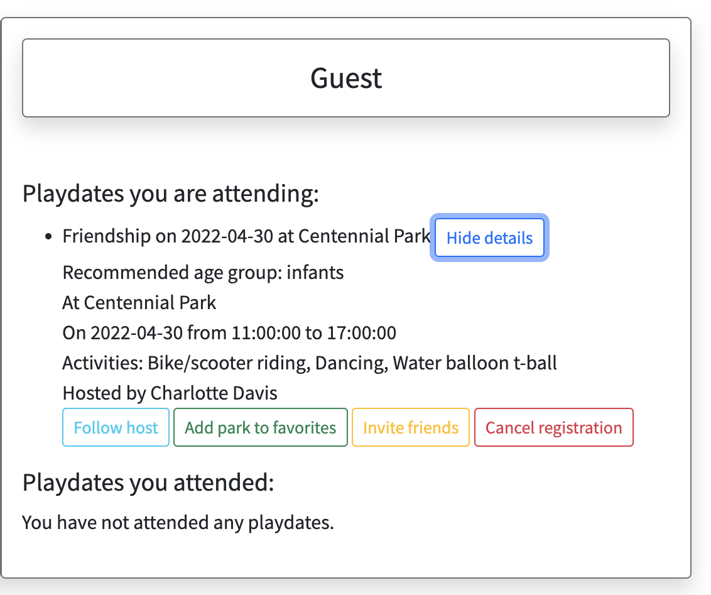

# Project Playdate Birdies

A web app where parents and grandparents can find playdates for their children.

For a demo of my app, please visit this link <a href="https://www.youtube.com/watch?v=u-X1LhxQtec">Playdate Birdies Demo</a>.

## About

- Playdate Birdies is a community of parents and grandparents who love to bring their kids to outdoor activities to learn, play and make friends.
- No matter how young children are, outdoor activities are beneficial to their development.
- Interacting with other kids of similar age helps them socialize and have fun.
- Parents can volunteer to host a playdate at their chosen location (usually a public park). Other parents can search for a playdate of their interest and register to join.
- The app supports other features, such as following hosts, send email invitations to friends, add events to personal calendar, receive email reminders, and suggest playdates based on users' interests.
- Let's help our kids play, grow and make friends, one playdate at a time.
<p align="center">
  
 </p>
 <p align="center">
  
 </p>
 

## Technologies Used

- Back-end: Python (Flask, SQLAlchemy, Flask-Mail, Celery)
- Database: SQL, PostgreSQL, SQLAlchemy
- Front-end: Javascript, HTML, Bootstrap, AJAX, JSON, Jinja, React
- APIs: Google Map APIs (Maps JavaScript API, Places API, Geolocation API)

## Features

- Users can create an account, login, reset password and logout. Users' data is saved in the database with password being hashed by Python library passlib, argon2 for security.
<p align="center">          
  
</p>

- Users can perform a search for a playdate by one or multiple parameters such as city or zipcode, date, age group, and/or activities. This searching feature is implemented by query chains in SQLAlchemy to the PostgreSQL database. Check out <a href="https://github.com/hoaian-phan/project-playdate-birdies/blob/main/crud.py">my query chains (line 103 - 121) </a>.
<p align="center">          
  
</p>

- Search results show playdate details with location markers on the map as well as user's location (if granted permission). I implemented this page using Google Maps APIs to display map, location markers and user's location. Result details are shown by DOM manipulation in JavaScript. Check out how I <a href="https://github.com/hoaian-phan/project-playdate-birdies/blob/main/static/js/search_maps.js">displayed map and location markers</a>.
<p align="center">          
  
</p>

- Register feature: REACT page with updates of who's coming to the playdate and option to receive email reminder. Email feature was implemented by Flask-Mail and reminders are scheduled using Celery. Check out <a href="https://github.com/hoaian-phan/project-playdate-birdies/blob/main/static/js/register_react.jsx">my React register feature</a>.
<p align="center">          
  
</p>                                                    

- Hosting feature, with the help of address autocompletion in Google Map APIs.
<p align="center">          
  
</p>

- User profile with contact info, favorite and events as list. Users can update profile or change their password anytime.
<p align="center">          
  
</p>

- Users can view their playdates in calendar. I implemented this calendar by using FullCalendar in JavaScript. See <a href="https://github.com/hoaian-phan/project-playdate-birdies/blob/main/static/js/calendar.js">my JS calendar code </a> and <a href="https://github.com/hoaian-phan/project-playdate-birdies/blob/main/server.py">my show calendar route (line 767-797)</a>.
<p align="center">          
  
</p>

- Follow hosts, add park to favorites, cancel playdates or registrations with email notifications to the host/participants. All changes are updated in the database.
<p align="center">          
  
</p>

- Send email invitations to friends. An email with the event registration link will be sent to selected friends and they can register if interested.
<p align="center">          
  
</p>

- Personalize playdate suggestions based on users' interests. A list of recommended playdates sorted by score and date is displayed on the homepage for logged in users to browse. Check out <a href="https://github.com/hoaian-phan/project-playdate-birdies/blob/main/crud.py">my scoring algorithm (line 167-213)</a> and <a href="https://github.com/hoaian-phan/project-playdate-birdies/blob/main/server.py">my sorting algorithm (line 104-130)</a>.
<p align="center">          
  
</p>

## Set Up

To run this project, install it locally:

- Clone this repository
```
$ git clone https://github.com/hoaian-phan/project-playdate-birdies.git
```

- Go into the repository
```
$ cd project-playdate-birdies
```

- Create a virtual environment on MacOS
```
$ virtualenv env
```
On Windows OS
``` 
$ virtualenv env --always-copy
```

- Activate virtual env
``` 
$ source env/bin/activate
```

- Install dependencies
```
$ pip3 install -r requirements.txt
```

- Create a secrets.sh file to assign a value to APP_SECRET_KEY and run it
```
source secrets.sh
```

- (Optionally) Seed the database: 
``` python3 seed_database.py ```
Note: if you do not run ```seed_database.py```, make sure you create a database named ```playdates``` as well as the tables by running the following commands:
```
createdb playdates 
python3 -i model.py
>>> db.create_all()
```

- Run the app
```
$ python3 server.py
```

You can now navigate to 'localhost:5000/' to access Playdate Birdies.


## Project Status: 
Project is completed. Future updates inlcude setting up mail server (instead of test mail server) and deploy.

## Credits:
- I learned how to use Celery from miguelgrinberg: https://github.com/miguelgrinberg/flask-celery-example and Robley Gori https://stackabuse.com/asynchronous-tasks-using-flask-redis-and-celery/
- I learned how to use FullCalendar from Gordon Chan https://www.youtube.com/watch?v=VXW2A4Q81Ok
- Many thanks my to instructors, Jocelyn Tang and Steve Chait, my cohort TA Drue Gilbert, my mentor Joyaan Bhesania for helping me with my project.
- Special thanks to my baby Andy Gia Hoa Phan for being the inspiration for my project.

